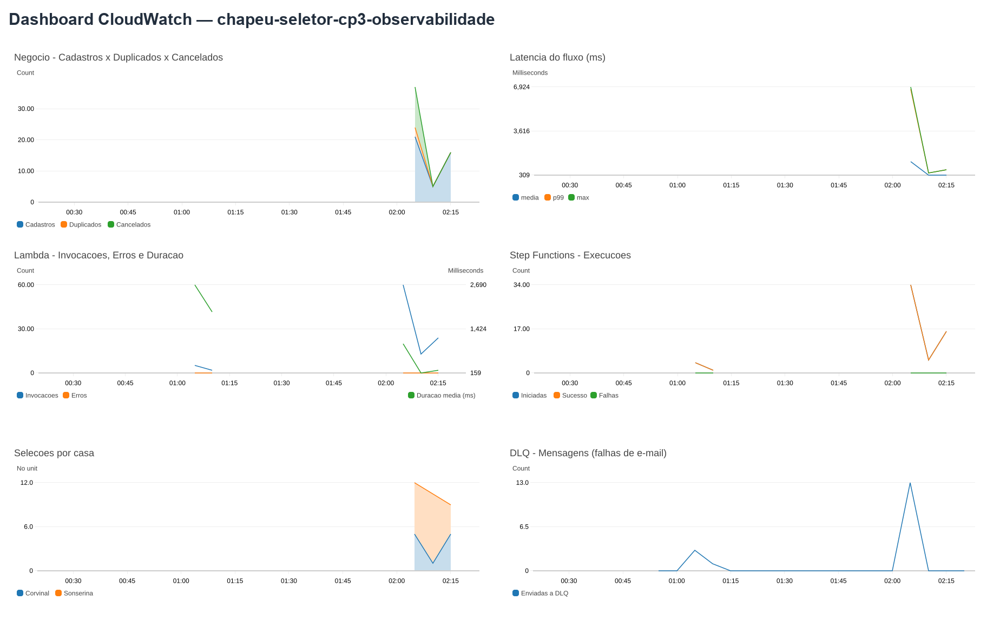
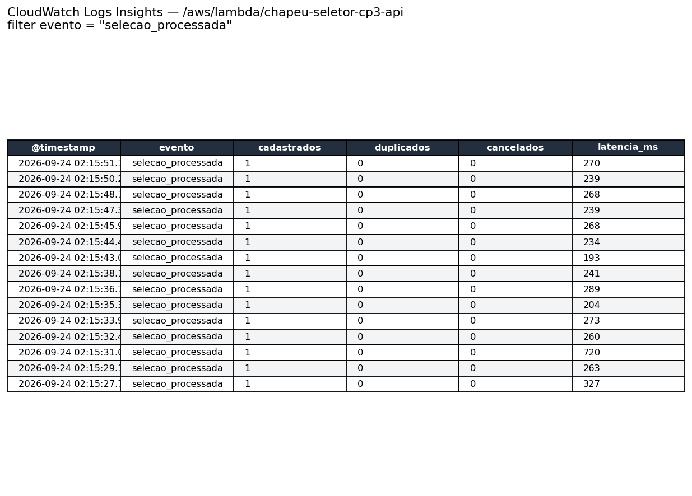
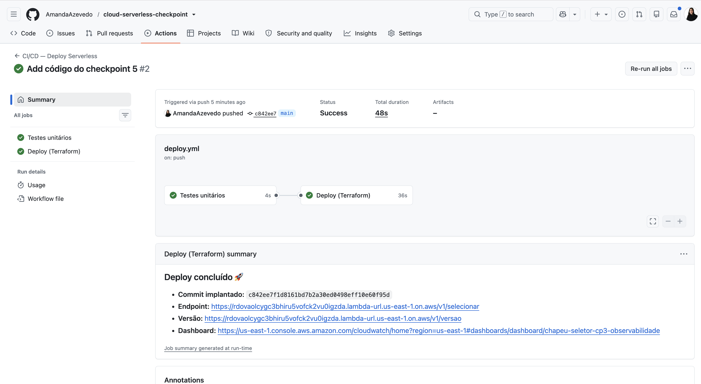

# Checkpoint 4 — Chapéu Seletor Serverless: Observabilidade

Pipeline serverless **event-driven** na AWS que simula o Chapéu Seletor de
Hogwarts: um aluno é cadastrado (nome + e-mail), o sistema sorteia a casa,
persiste o resultado e **notifica por e-mail**. Toda a lógica é orquestrada por
**Step Functions** com integrações nativas (sem Lambda no fluxo).

O foco deste checkpoint é a **observabilidade**: o serviço foi instrumentado com
**logging estruturado** e **métricas customizadas** no **AWS CloudWatch**, com um
**dashboard** e uma **análise crítica de performance e custo** com otimizações
fundamentadas em dados reais.

## Sumário
- [Arquitetura](#arquitetura)
- [API (endpoints)](#api-endpoints)
- [Código da Lambda](#código-da-lambda-lambda_functionpy)
- [Fluxo do Step Functions](#fluxo-do-step-functions-statemachineasljson)
- [Infraestrutura (Terraform)](#infraestrutura-terraform)
- [Observabilidade (Checkpoint 4)](#observabilidade-checkpoint-4)
- [Evidências (prints)](#evidências-prints)
- [Análise crítica e otimizações](#análise-crítica-de-performance-e-custo)
- [Como rodar, testar e implantar](#como-rodar-testar-e-implantar)
- [CI/CD — deploy automático](#cicd--deploy-automático)
- [Segurança](#segurança)
- [Estrutura do repositório](#estrutura-do-repositório)

## Arquitetura


**Provedor:** AWS — **Lambda** (HTTP), **Step Functions** (orquestração),
**DynamoDB** (dados), **SQS** (dead-letter queue), **SES** (e-mail) e
**CloudWatch** (observabilidade).

Fluxo de uma seleção:

1. A **Lambda** recebe o HTTP e inicia a execução **síncrona** do Step Functions.
2. O Step Functions **sorteia** a casa, atribui um **lema**, **persiste** no
   DynamoDB (e-mail único) e **notifica** por e-mail (SES).
3. Se o e-mail falhar, faz **rollback** (desfaz o cadastro) e envia a mensagem
   para a **DLQ**.
4. A Lambda mede a latência, **loga** de forma estruturada e **emite métricas**.

## API (endpoints)

A mesma Function URL atende dois caminhos:

| Método | Caminho | Descrição |
|---|---|---|
| `POST` | `/v1/selecionar` | Cadastra 1 aluno (`{"nome","email"}`) ou vários (`{"alunos":[...]}`) |
| `GET`  | `/v1/alunos` | Lista os alunos cadastrados |
| `GET`  | `/v1/versao` | Mostra a versão e o **commit** implantado (verifica se o deploy funcionou) |

Regras: **e-mail obrigatório** e **único**; se o e-mail não puder ser enviado, o
cadastro é **cancelado** (rollback).

## Código da Lambda (`lambda_function.py`)

Uma **única função** (`lambda_handler`) roteia por caminho + método:

- **`_selecionar(event)`** — valida a entrada, chama `StartSyncExecution` no Step
  Functions, mede a **latência**, e emite **log estruturado** + **métricas** por
  status (`Cadastros`, `Duplicados`, `Cancelados`) e por casa (`SelecoesPorCasa`).
- **`_listar()`** — faz `Scan` no DynamoDB e emite métricas `Consultas` /
  `AlunosNaBase`.
- **Instrumentação** (núcleo do checkpoint):
  - `_log(evento, **campos)` → um log JSON por evento.
  - `_metricas(valores, dimensoes, unidades)` → métricas no formato **EMF**.

Sem dependências externas — apenas a biblioteca padrão do Python + `boto3` (já no
runtime da Lambda).

## Fluxo do Step Functions (`statemachine.asl.json`)

State machine **Express**, do tipo **Map** (processa lote de alunos), com estas
etapas por aluno:

| Estado | Tipo | O que faz |
|---|---|---|
| `Sortear` → `EscolherCasa` | Pass | Sorteia a casa (`States.MathRandom` + `ArrayGetItem`) |
| `RamificarPorCasa` + `Lema*` | Choice/Pass | Atribui o lema conforme a casa |
| `Persistir` | Task | `dynamodb:putItem` com `attribute_not_exists(email)` (idempotência) |
| `Notificar` | Task | `ses:sendEmail`; **Retry** e, se falhar, `Catch` → rollback |
| `MarcarNotificado` | Task | `dynamodb:updateItem` → `notificado=true` (sucesso) |
| `DesfazerCadastro` | Task | **Rollback** `dynamodb:deleteItem` (falha de e-mail) |
| `NotificacaoParaDLQ` | Task | `sqs:sendMessage` → DLQ |
| `Sucesso` / `EmailDuplicado` / `CadastroCancelado` | Pass | Resultado final por aluno |

Conceitos demonstrados: **orquestração na ordem correta**, **idempotência**,
**retry** com backoff, **dead-letter queue** e **rollback** (compensação/saga).

## Infraestrutura (Terraform)

Toda a infra é definida em `terraform/` (state remoto no **S3**):

| Arquivo | Conteúdo |
|---|---|
| `main.tf` | DynamoDB, SQS DLQ, SES, Step Functions (+IAM), Lambda (+Function URL/IAM), **dashboard CloudWatch** |
| `locals.tf` | Definição do **dashboard** (widgets das métricas) |
| `variables.tf` | `region`, `prefix`, `allowed_origins`, `sender_email` |
| `outputs.tf` | `selecionar_endpoint`, `list_endpoint`, `state_machine_arn`, `dlq_url`, **`dashboard_url`** |
| `backend.tf.example` | Modelo do backend S3 (o `backend.tf` real fica fora do Git) |

**IAM mínimo (least privilege):** o Step Functions só pode `PutItem/UpdateItem/
DeleteItem` na tabela, `SendMessage` na DLQ e `SendEmail`; a Lambda só pode
`StartSyncExecution` e `Scan`.

## Observabilidade (Checkpoint 4)

### 1. Logging estruturado (JSON)
Cada evento vira um log JSON com campos padronizados — ex.:
`{"evento":"selecao_processada","latencia_ms":82,"cadastrados":0,"duplicados":1,...}`.
Isso permite consultar e agregar no **CloudWatch Logs Insights**.

### 2. Métricas customizadas (EMF)
Emitidas no próprio log (**Embedded Metric Format**, sem chamadas extras à API),
no namespace **`ChapeuSeletor`**: `Cadastros`, `Duplicados`, `Cancelados`,
`LatenciaFluxoMs`, `SelecoesPorCasa` (por casa), `Consultas`, `AlunosNaBase`,
`FluxoFalhou`.

### 3. Métricas nativas
Lambda (`Invocations`, `Errors`, `Duration`), Step Functions
(`ExecutionsStarted/Succeeded/Failed`, `ExecutionTime`) e SQS (DLQ).

### 4. Dashboard CloudWatch
Provisionado por Terraform (`chapeu-seletor-cp3-observabilidade`), reunindo todas
as métricas acima. A URL é o output `dashboard_url`.

### Como visualizar
Console → CloudWatch → **Logs Insights**, log group
`/aws/lambda/chapeu-seletor-cp3-api`:

```
fields @timestamp, evento, cadastrados, duplicados, cancelados, latencia_ms
| filter evento = "selecao_processada"
| sort @timestamp desc | limit 20
```

## Evidências (prints)

Screenshots que comprovam logs e métricas (em [`docs/prints/`](docs/prints/)):

**Dashboard CloudWatch** — métricas de negócio, latência, Lambda, Step Functions,
seleções por casa e DLQ, todas com dados reais:



**Logs estruturados (CloudWatch Logs Insights)** — cada evento vira uma linha JSON
consultável; note o contraste de `latencia_ms` (baixa sem envio, alta quando há
falha de e-mail):



## Análise crítica de performance e custo

Baseada em **métricas reais** coletadas no CloudWatch (8 seleções: 1 cadastro,
1 duplicado, 6 cancelados + 4 consultas).

| Métrica | Valor |
|---|---|
| Invocações da Lambda | 44 |
| Duração da Lambda (média / máx) | 1.178 ms / 6.106 ms |
| Latência do fluxo síncrono (média / máx) | 3.216 ms / 5.962 ms |
| Tempo de execução do Step Functions (média) | 1.904 ms |
| Latência — **duplicado** (sem envio) | **82 ms** |
| Latência — **cancelado** (falha de e-mail) | **~3.300 ms** |
| Mensagens enviadas à DLQ | 14 |

**Performance:** a latência é dominada pelo **caminho de falha de e-mail** —
82 ms vs ~3.300 ms (40x). A causa é o `Retry` do `Notificar` sobre um erro
**permanente** (`Ses.MessageRejectedException`), que nunca teria sucesso.

**Custo:** no modelo **síncrono**, cada segundo do fluxo é cobrado na **Lambda**
**e** no **Step Functions Express** (ambos por tempo) — os ~3 s de retry inútil
custam em dobro. E cada cancelado faz `putItem` + `deleteItem` (o dobro de
escritas no DynamoDB).

### Otimizações propostas

1. **Não repetir erros permanentes do SES.** Restringir o `Retry` do `Notificar`
   a erros transitórios (throttling/serviço). *Impacto:* latência da falha de
   **~3,3 s → ~0,3 s**; corta tempo faturado em Lambda **e** Step Functions.
2. **Notificar antes de persistir.** Reordenar para `Sortear → Notificar →
   Persistir` elimina o rollback (`putItem` + `deleteItem`). *Impacto:* **−50%**
   de escritas no DynamoDB no caminho de falha.
3. **Reduzir o custo do bloqueio síncrono.** Execução assíncrona (`202 Accepted`)
   em lotes, *tuning* de memória (Power Tuning) e retenção de logs. *Impacto:*
   Lambda deixa de faturar a espera; controla o custo de observabilidade.

## Como rodar, testar e implantar

**Testes locais** (sem nuvem):

    python3 -m unittest -v

**Deploy** (Terraform + AWS CLI configurado):

    cd terraform
    cp backend.tf.example backend.tf   # ajuste o nome do bucket (state no S3)
    # em terraform.tfvars, defina sender_email = "seu-email-verificado@dominio.com"
    terraform init
    terraform apply

**Testar na nuvem:**

    curl -X POST "<selecionar_endpoint>" -H "Content-Type: application/json" \
      -d '{"nome":"Amanda","email":"seu-email-verificado@dominio.com"}'
    curl "<list_endpoint>"

**Passos manuais (uma vez):** verificar o remetente no **SES** e habilitar o
acesso público da **Function URL** (Auth NONE) no Console.

## CI/CD — deploy automático

O deploy é **100% automatizado** com **GitHub Actions**
([`.github/workflows/deploy.yml`](.github/workflows/deploy.yml)). A cada `push`
na `main` que altere o código, o fluxo ou a infraestrutura, o pipeline roda em
dois estágios:

1. **`test`** — instala o Python e roda os testes unitários (`python -m unittest`).
   Se algum falhar, o deploy **não** acontece.
2. **`deploy`** (só se os testes passarem) — configura as credenciais AWS a partir
   dos **Secrets**, gera o `backend.tf` (a partir do Secret do bucket) e executa
   `terraform init → validate → apply`. O commit implantado é injetado na Lambda
   (`TF_VAR_app_version = github.sha`).

**Credenciais** vêm de *GitHub Secrets* (`AWS_ACCESS_KEY_ID`,
`AWS_SECRET_ACCESS_KEY`, `TF_STATE_BUCKET`, `SENDER_EMAIL`) — nunca do código. O
usuário IAM usado tem uma **policy mínima**, escopada aos recursos do projeto.

### Evidência do deploy

Execução do pipeline no GitHub Actions (jobs `test` e `deploy` verdes):




**Verificação automática pelo endpoint de versão:** o `GET /v1/versao` devolve o
**commit** que está de fato rodando na nuvem. Basta comparar com o SHA do último
commit / do log do Actions:

    curl "<function_url>/v1/versao"
    # {"versao":"1.0.0","commit":"<sha-do-ultimo-commit>","lambda_version":"$LATEST",...}

Se o `commit` do endpoint == o SHA do commit no GitHub == o "Commit implantado" no
resumo do job, o deploy automático está comprovadamente funcionando.

## Segurança

- Nenhuma credencial, chave, `.json`/`.env` ou o `backend.tf`/`terraform.tfvars`
  (com Account ID / dados sensíveis) é versionado — ver [`.gitignore`](.gitignore).
- IAM por serviço com privilégio mínimo.
- Logs/métricas registram apenas dados de negócio (nome, e-mail, casa).

## Estrutura do repositório

```
.
├── lambda_function.py          # Lambda (endpoints + instrumentação)
├── statemachine.asl.json       # fluxo do Step Functions
├── test_lambda_function.py     # testes unitários
├── requirements.txt
├── terraform/                  # infraestrutura (IaC) + dashboard
│   ├── main.tf · locals.tf · variables.tf · outputs.tf
│   └── backend.tf.example
└── docs/
    ├── arquitetura.svg / .drawio
    └── prints/                 # evidências visuais (screenshots)
```
