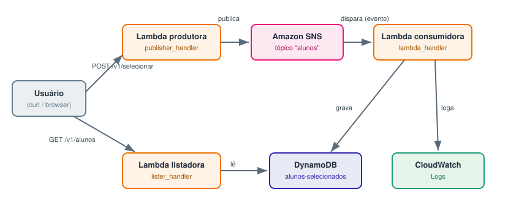
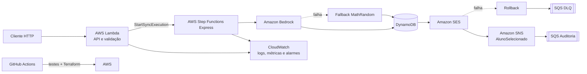

# Chapéu Seletor Serverless — arquitetura event-driven com IA

Projeto final da disciplina de **Serverless Computing e Arquiteturas Event-Driven**.
A solução recebe um aluno e suas características, usa **Amazon Bedrock** para
escolher uma casa de Hogwarts, persiste o resultado, envia a notificação e
publica um evento de domínio para consumidores desacoplados.

O repositório consolida funções serverless, eventos, orquestração,
observabilidade, segurança, infraestrutura como código e CI/CD em uma entrega
única.

## Arquitetura final





### Fluxo ponta a ponta

1. `POST /v1/selecionar` recebe um aluno ou um lote de até 25 alunos.
2. A Lambda valida e normaliza a entrada e inicia um **Express Workflow
   síncrono**.
3. O estado `Map` processa até cinco alunos em paralelo para limitar pressão
   sobre Bedrock e SES.
4. O Bedrock classifica o perfil e devolve casa + justificativa. Erro, timeout ou
   resposta sem uma casa reconhecível aciona o fallback aleatório.
5. O DynamoDB grava condicionalmente por e-mail; a condição torna o comando
   idempotente.
6. O SES envia o resultado. Se falhar, a Step Functions executa a compensação
   (remove o cadastro) e registra a ocorrência na DLQ.
7. Após o sucesso, o fluxo publica `AlunoSelecionado` no SNS. A fila de auditoria
   recebe o evento de modo assíncrono e outros consumidores podem ser adicionados
   sem mudar o caminho principal.
8. Logs estruturados, métricas EMF, dashboard e alarmes ficam no CloudWatch.

## Rastreabilidade dos checkpoints

| Entrega | Requisito principal | Evidência neste repositório |
|---|---|---|
| **Checkpoint 3** | Fluxo ordenado, idempotência, retry e DLQ | `statemachine.asl.json`, escrita condicional no DynamoDB, retries, compensação e SQS DLQ |
| **Checkpoint 4** | Logs, métricas, prints e 2–3 otimizações fundamentadas | EMF/logs na Lambda, dashboard/alarmes no Terraform, `docs/prints/` e análise abaixo |
| **Checkpoint 5** | CI/CD automático e prova da execução | `.github/workflows/deploy.yml`, validações antes do apply e print do Actions |
| **Projeto final** | Arquitetura integrada com IA e justificativas | Bedrock + fallback, SNS/SQS, diagrama, decisões técnicas e roteiro de vídeo |

A implementação usa serviços equivalentes da AWS, opção permitida pelos
enunciados: Step Functions no lugar de Cloud Workflows e CloudWatch no lugar de
Cloud Logging/Monitoring.

## Orquestração x coreografia

Esta separação é a principal decisão arquitetural do projeto:

| Abordagem | Onde foi usada | Por quê |
|---|---|---|
| **Orquestração** | Bedrock → DynamoDB → SES → compensação | O caminho crítico exige ordem, retry, estado e rollback explícitos. A Step Functions deixa essas regras visíveis e auditáveis. |
| **Coreografia** | SNS `AlunoSelecionado` → SQS auditoria | O tempo de execução dos consumidores não deve ficar acoplado ao produtor. Novos assinantes podem reagir ao evento de forma independente. |

Usar somente coreografia no caminho crítico dificultaria enxergar e compensar
falhas. Usar somente orquestração faria cada novo consumidor exigir alteração
do workflow.

## Decisões técnicas

- **Uma Lambda fina na borda.** Centraliza roteamento e validação HTTP, mas
  deixa a regra de negócio no workflow. Isso reduz código de integração e cold
  starts adicionais.
- **Step Functions Express síncrono.** O cliente recebe a seleção na mesma
  chamada, algo apropriado para a demonstração. O trade-off é manter a Lambda
  aguardando; em grande escala, a alternativa seria `202 Accepted` + consulta de
  status ou callback.
- **Integrações nativas.** Bedrock, DynamoDB, SES, SNS e SQS são chamados sem
  Lambdas intermediárias, reduzindo código operacional e superfície de falha.
- **IA com degradação graciosa.** O modelo agrega uma justificativa baseada nas
  características, mas não é ponto único de falha. `Catch` e validação da
  resposta encaminham para um sorteio entre as quatro casas.
- **Idempotência no armazenamento.** E-mail é a chave do DynamoDB e
  `attribute_not_exists(email)` impede duplicidade mesmo sob concorrência.
- **Saga por compensação.** Se o e-mail falha depois da escrita, o cadastro é
  removido. Se uma confirmação ou evento fica pendente, a DLQ guarda contexto
  para reconciliação sem declarar um sucesso falso.
- **DynamoDB sob demanda.** `PAY_PER_REQUEST` evita capacidade ociosa e combina
  com a carga pequena e irregular de um projeto acadêmico.
- **Terraform.** Infraestrutura reproduzível, revisável e com state remoto no S3.

## API

| Método | Caminho | Finalidade |
|---|---|---|
| `POST` | `/v1/selecionar` | Classifica um aluno ou lote |
| `GET` | `/v1/alunos` | Lista os registros persistidos |
| `GET` | `/v1/versao` | Mostra versão e commit implantados |

Exemplo individual:

```bash
curl -X POST "$FUNCTION_URL/v1/selecionar" \
  -H "Content-Type: application/json" \
  -d '{
    "nome": "Amanda",
    "email": "amanda@example.com",
    "caracteristicas": "curiosa, leal e gosta de resolver problemas"
  }'
```

Exemplo em lote:

```json
{
  "alunos": [
    {"nome": "Ana", "email": "ana@example.com", "caracteristicas": "corajosa"},
    {"nome": "Bia", "email": "bia@example.com", "caracteristicas": "criativa e estudiosa"}
  ]
}
```

Restrições: nome e e-mail obrigatórios, e-mail normalizado em minúsculas,
máximo de 25 alunos por chamada e 500 caracteres de perfil.

## Resiliência e consistência

- Retry com backoff apenas antes do `Catch` nas integrações remotas.
- Fallback local quando a IA está indisponível ou responde fora do contrato.
- Escrita condicional contra duplicidade.
- Rollback do DynamoDB quando a notificação falha.
- DLQ com retenção de 14 dias para falhas que exigem intervenção.
- Resultado `pendente` quando o e-mail foi entregue, mas uma etapa posterior
  precisa de reconciliação.
- Limite de concorrência no `Map` para reduzir throttling e controlar custo.

## Observabilidade

A Lambda escreve logs JSON e métricas no formato **Embedded Metric Format**,
sem chamada adicional à API do CloudWatch.

Métricas de negócio:

- `Cadastros`, `Duplicados`, `Cancelados` e `Pendentes`;
- `SelecoesPorCasa`;
- `LatenciaFluxoMs` e `FluxoFalhou`;
- `Consultas` e `AlunosNaBase`.

O Terraform cria o dashboard e alarmes para erros não tratados da Lambda e
mensagens visíveis na DLQ. O log da Step Functions não inclui os dados de
execução, evitando copiar nome, e-mail e perfil para o CloudWatch.

As imagens em [`docs/prints/`](docs/prints/) registram as evidências coletadas
durante o checkpoint de observabilidade. Depois do deploy final, recomenda-se
atualizar ao menos os prints do workflow, da Step Functions com Bedrock e do
dashboard com a métrica `Pendentes`.

### Análise crítica de performance e custo

A medição do Checkpoint 4 foi feita antes das otimizações finais, com oito
seleções e quatro consultas. Esses valores são evidência histórica, não uma
promessa de desempenho para toda carga:

| Indicador observado | Valor |
|---|---:|
| Invocações da Lambda | 44 |
| Duração da Lambda — média / máxima | 1.178 ms / 6.106 ms |
| Latência do fluxo — média / máxima | 3.216 ms / 5.962 ms |
| Tempo médio da Step Functions | 1.904 ms |
| Caminho duplicado, sem envio de e-mail | 82 ms |
| Caminho cancelado por falha de e-mail | aproximadamente 3.300 ms |

O principal gargalo foi o retry de um erro permanente do SES. Como a execução
é síncrona, a espera era faturada simultaneamente na Lambda e na Step Functions
Express; o rollback também acrescentava uma segunda escrita no DynamoDB.

### Otimizações fundamentadas

1. **Repetir somente falhas transitórias do SES — implementada.** O workflow
   repete throttling, indisponibilidade e timeout, mas envia rejeições permanentes
   diretamente para compensação. A expectativa baseada na amostra é reduzir o
   caminho de falha de cerca de 3,3 s para centenas de milissegundos.
2. **Controlar paralelismo e desacoplar consumidores — implementada.** O `Map`
   limita a concorrência a cinco, reduzindo throttling no Bedrock/SES, e efeitos
   posteriores consomem `AlunoSelecionado` por SNS/SQS sem bloquear pelo tempo de
   execução de cada consumidor.
3. **Migrar a API para aceitação assíncrona em maior escala — proposta.** Um
   `202 Accepted` com identificador e consulta de status eliminaria a espera
   faturada da Lambda. Não foi adotado aqui porque a resposta imediata simplifica
   a demonstração e os testes do professor; o trade-off é maior latência/custo
   por requisição longa.

Uma quarta evolução seria paginar `GET /v1/alunos` na própria API, com
`limit/nextToken`, evitando carregar toda a tabela em memória quando o volume
deixar de ser acadêmico.

## Segurança

- Nenhuma chave, credencial, `.env`, `*.tfvars`, state ou `backend.tf` é
  versionado; confira [`.gitignore`](.gitignore).
- O CI recebe credenciais e parâmetros apenas por GitHub Secrets.
- Endpoints e identificadores do ambiente são outputs sensíveis do Terraform e
  não são impressos no resumo público do GitHub Actions. A URL ativa deve ser
  enviada somente no campo privado de comentários do Canvas.
- IAM separa a Lambda da Step Functions e restringe ações aos recursos do
  projeto sempre que o serviço permite.
- DynamoDB e filas SQS usam criptografia em repouso.
- O payload HTTP tem formato, tamanho e e-mail validados; erros internos não são
  devolvidos ao cliente.
- Dados pessoais não são incluídos nos logs de execução da Step Functions.
- A Function URL usa `AuthType=NONE` apenas por ser uma demonstração pública.
  Em produção, a borda deve migrar para API Gateway com autorizador e rate
  limiting, ou para Function URL com `AWS_IAM`.


## Testes e validação local

Pré-requisitos: Python 3.12 e Terraform 1.5 ou superior.

```bash
python3 -m unittest -v
python3 -m json.tool statemachine.asl.json >/dev/null
terraform fmt -check -recursive
terraform -chdir=terraform init -backend=false
terraform -chdir=terraform validate
```

Os testes são locais e usam mocks; não consomem recursos AWS nem exigem
credenciais.

## Deploy manual

Pré-requisitos na conta AWS:

1. acesso ao modelo Amazon Nova Lite no Bedrock, na região configurada;
2. remetente verificado no SES e, enquanto a conta estiver no sandbox,
   destinatários também verificados;
3. bucket S3 privado para o state do Terraform;
4. AWS CLI autenticada com permissões para provisionar os recursos.

```bash
cd terraform
cp backend.tf.example backend.tf
cp terraform.tfvars.example terraform.tfvars
# Edite somente os arquivos locais acima; ambos estão ignorados pelo Git.
terraform init
terraform plan
terraform apply
```

O `sender_email` é obrigatório e validado pelo Terraform. Após o apply, use os
outputs `selecionar_endpoint`, `list_endpoint`, `version_endpoint` e
`dashboard_url`. Como são sensíveis, consulte um valor individual em ambiente
autenticado, por exemplo: `terraform output -raw selecionar_endpoint`.

## CI/CD

O workflow [`.github/workflows/deploy.yml`](.github/workflows/deploy.yml) executa:

1. testes unitários e validação do JSON da state machine;
2. `terraform fmt`, inicialização sem backend e `terraform validate`;
3. deploy somente em `push` na `main` ou disparo manual, depois das validações;
4. resumo com commit, endpoints e dashboard.

Secrets necessários:

| Secret | Uso |
|---|---|
| `AWS_ACCESS_KEY_ID` | Autenticação do deploy |
| `AWS_SECRET_ACCESS_KEY` | Autenticação do deploy |
| `TF_STATE_BUCKET` | Bucket privado do state remoto |
| `SENDER_EMAIL` | Remetente verificado no SES |


## Estrutura

```text
.
├── .github/workflows/deploy.yml
├── docs/
│   ├── arquitetura.svg
│   └── prints/
├── terraform/
│   ├── main.tf
│   ├── locals.tf
│   ├── variables.tf
│   └── outputs.tf
├── lambda_function.py
├── statemachine.asl.json
└── test_lambda_function.py
```
